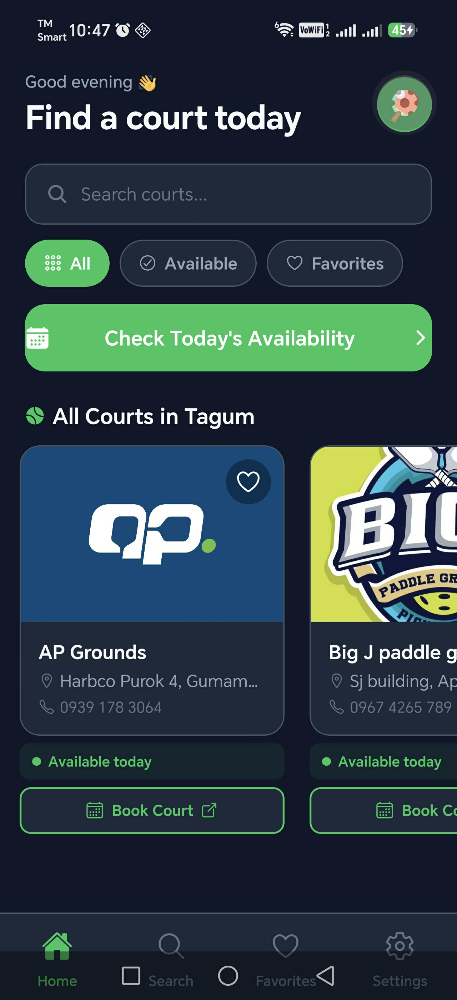
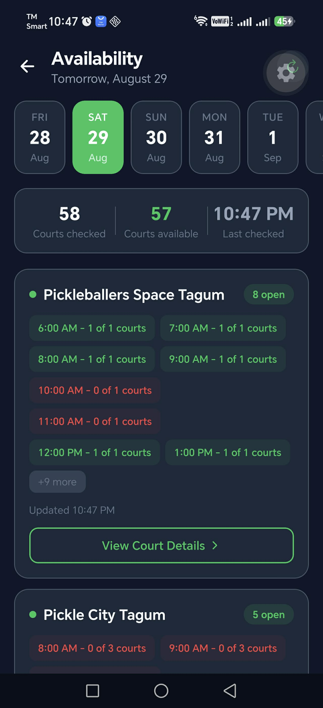
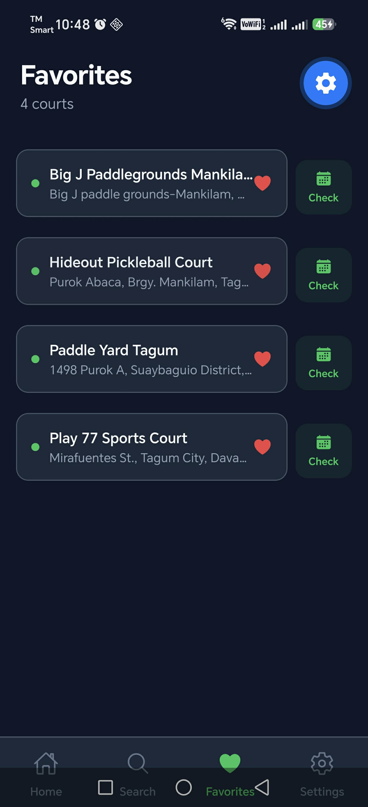
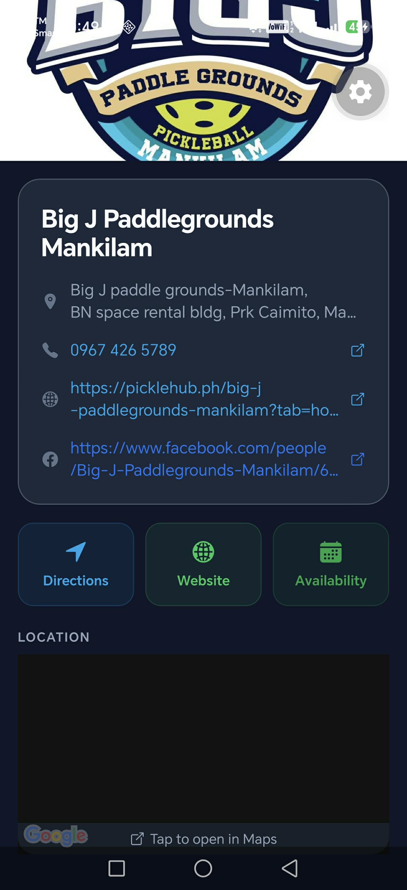

# 🏓 Tagum Pickleball Finder

Find available pickleball courts in Tagum City, Philippines — in real time.

[](https://www.typescriptlang.org/)
[](https://reactnative.dev/)
[](https://expo.dev/)
[](https://expressjs.com/)
[](https://supabase.com/)

---

## What It Does

Tagum Pickleball Finder lets you:

- **Search for available courts** by date across multiple venues in Tagum City
- **View real-time availability** fetched live from each court's booking website
- **Get directions** to any court via Google Maps
- **Save favorites** for courts you play at regularly
- **Dark mode** — looks great day or night

Availability data is **never cached** — every search fetches fresh data directly from the booking websites so you always see accurate slots.

---

## Screenshots

### Home

The home screen provides a quick overview of courts in Tagum City, with search, availability filtering, favorites, and direct booking access.



### Live Availability

Check court availability by date across multiple venues, with available and booked time slots grouped by court.



### Favorites

Save frequently used courts for quick access to their availability and booking information.



### Court Details

View court information, contact details, website and booking links, directions, and availability.



---

## Project Structure

```
tagum-pickleball-finder/
├── frontend/           # React Native / Expo mobile app
│   ├── src/
│   │   ├── screens/    # 7 screens (Splash, Home, Search, Details, Availability, Favorites, Settings)
│   │   ├── components/ # Reusable UI components
│   │   ├── navigation/ # React Navigation setup
│   │   ├── context/    # Theme + Favorites state
│   │   ├── services/   # API client (Axios)
│   │   └── utils/      # Date helpers, storage
│   └── App.tsx
│
├── backend/            # Express.js REST API
│   ├── src/
│   │   ├── parsers/    # Web scrapers (Cheerio + Playwright)
│   │   ├── services/   # Business logic
│   │   ├── controllers/
│   │   ├── routes/
│   │   ├── middleware/
│   │   ├── database/   # Supabase client
│   │   └── utils/
│   └── src/index.ts
│
├── shared/             # TypeScript types shared by both
├── database/           # Supabase schema + seed SQL
├── assets/             # App icons and splash
└── docs/               # Full documentation
```

---

## Quick Start

### Prerequisites
- Node.js ≥ 18
- Expo Go app on your phone (for development)
- Supabase account (free tier)
- Google Maps API key

### 1. Install dependencies

```bash
cd backend && npm install && cd ..
cd frontend && npm install && cd ..
cd shared && npm install && npm run build && cd ..
```

### 2. Configure environment

```bash
cp backend/.env.example backend/.env
cp frontend/.env.example frontend/.env
# Edit both files with your Supabase and Google Maps credentials
```

### 3. Set up the database

Run `database/schema.sql` then `database/seed.sql` in your Supabase SQL Editor.

### 4. Run it

```bash
# Terminal 1: backend
cd backend && npm run dev

# Terminal 2: mobile app
cd frontend && npx expo start
```

---

## Tech Stack

| Layer | Technology |
|-------|-----------|
| Mobile | React Native + Expo |
| Navigation | React Navigation v6 |
| State | React Context |
| HTTP client | Axios |
| Maps | React Native Maps + Google Maps |
| Backend | Node.js + Express |
| Language | TypeScript (strict) |
| Database | Supabase (PostgreSQL) |
| Scraping | Cheerio (static) + Playwright (dynamic) |

---

## Courts Supported

| Court | Parser | Method |
|-------|--------|--------|
| Pickleballers Space Tagum | `pickleballers` | Cheerio |
| Pickle City Tagum | `pickle_city` | Playwright |
| The Hideout | `hideout` | Cheerio |

Adding a new court takes ~30 minutes. See [docs/adding-a-parser.md](docs/adding-a-parser.md).

---

## API Endpoints

| Method | Route | Description |
|--------|-------|-------------|
| GET | `/api/v1/health` | Health check |
| GET | `/api/v1/courts` | All active courts |
| GET | `/api/v1/court/:id` | Single court |
| GET | `/api/v1/availability?date=YYYY-MM-DD` | Live availability from all courts |

Full API docs: [docs/api-reference.md](docs/api-reference.md)

---

## Documentation

- [Full documentation](docs/README.md) — Installation, setup, deployment
- [Adding a parser](docs/adding-a-parser.md) — How to add a new court
- [API reference](docs/api-reference.md) — All endpoints

---

## License

MIT
